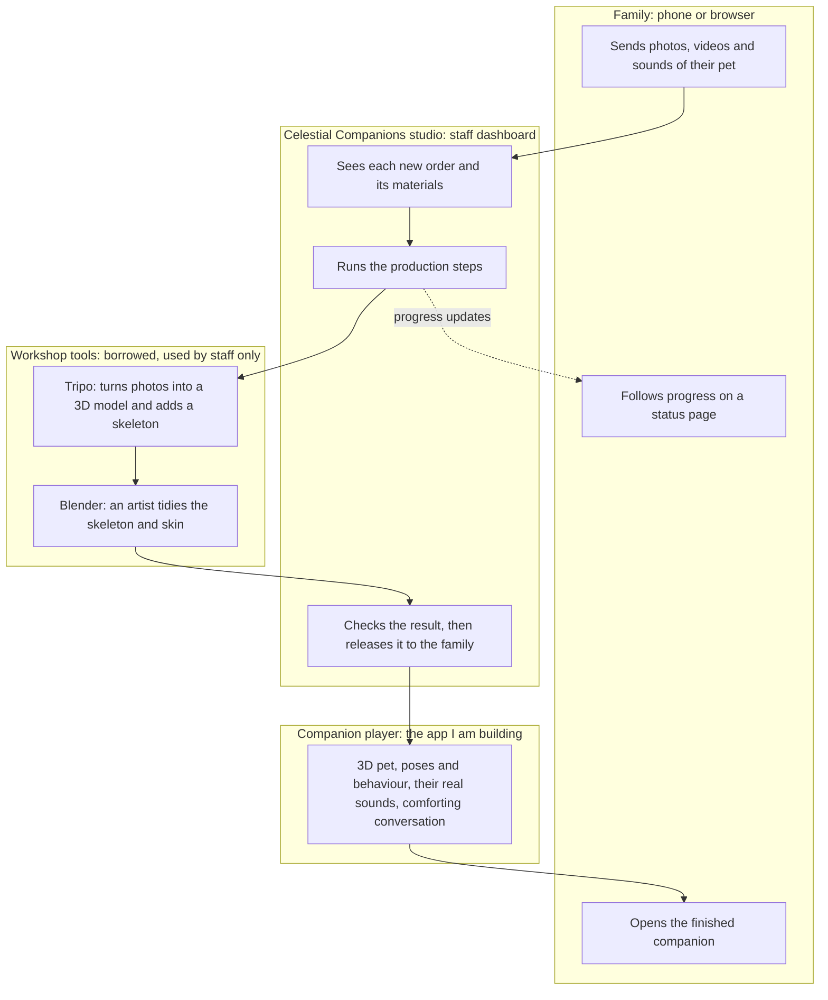
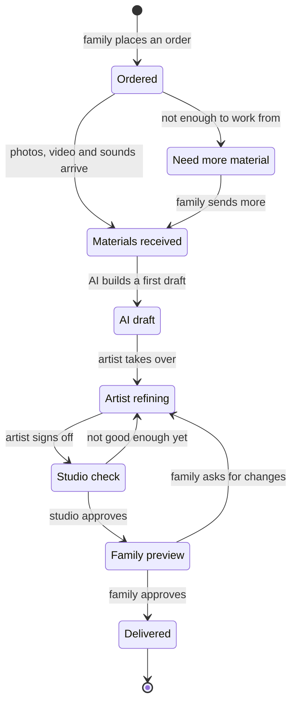
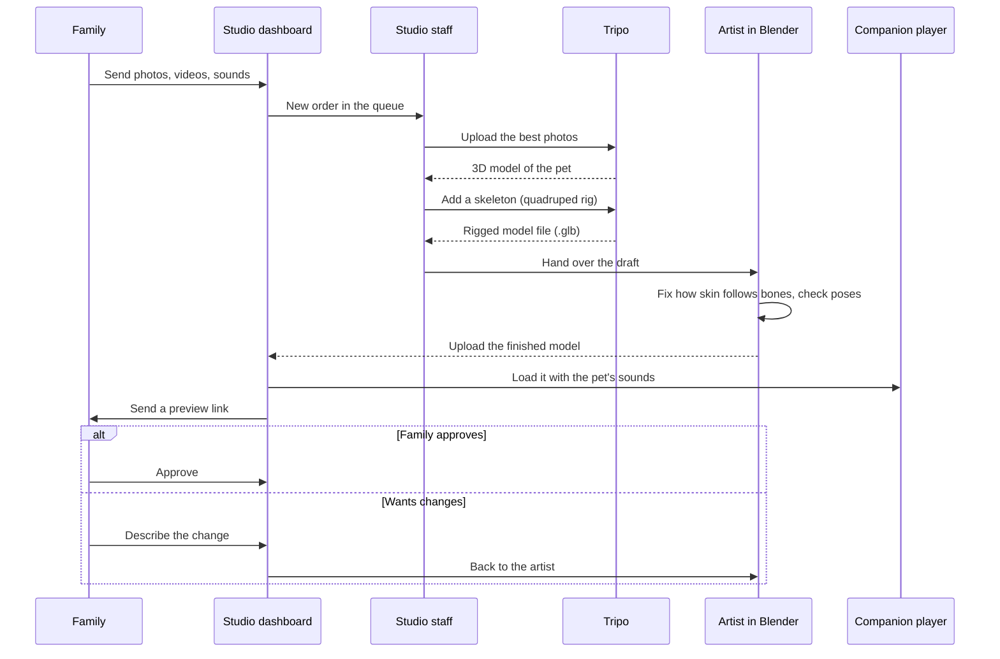
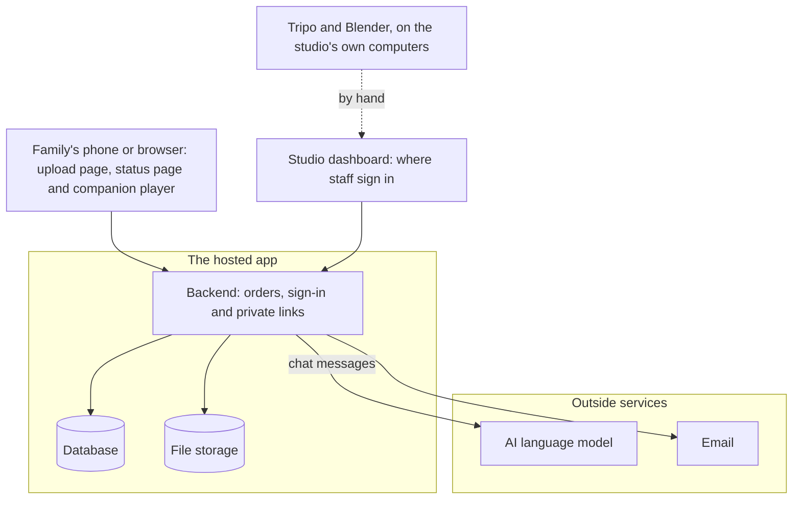
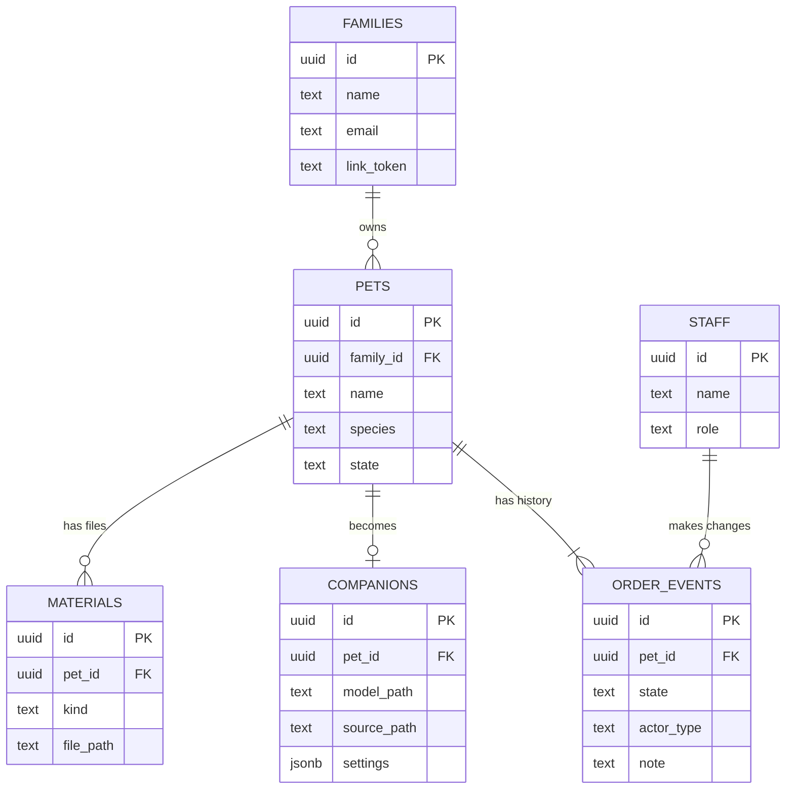

## Summary

This is my plan for how Celestial Companions fits together as a system: what a family sees, what the studio does behind the scenes, and which parts I build myself and which I borrow. It builds on the earlier research and on the companion prototype.

Nothing described here has been built yet, apart from the companion player itself, so please read it as a draft. If something is wrong or missing, tell me and I'll change the plan before I build.

In short:

-   A family sends photos and sounds of their pet. The studio turns them into a companion, with an AI tool making a first draft and an artist finishing it by hand. The family then opens it on their phone.
-   Tripo and Blender are the studio's workshop tools. Families never see them.
-   Families will wait for days, because the wait is the artist's time. I'd make sure the wait is never empty, and I can show you the whole journey without you waiting at all.
-   The first three stages of building come to about 5 to 9 weeks of work. The artist's time comes on top of that.

The time estimates are rough guesses. Prices, licence terms and tool details also still need checking before I rely on them.

## The system in one picture

There are four groups of things. I build and own the first three. The workshop tools are borrowed, and only the studio uses them.

*Figure 1. The whole system. The dotted line is progress news sent back to the family while they wait. Most of the days a family waits are spent in the middle, in the workshop.*

I build and own the family pages (upload and status), the studio dashboard and the companion player. I borrow Tripo for the 3D model and skeleton, and Blender for the artist's tidy-up. The comforting conversation would also need an AI language model behind it. I haven't chosen which one, and it's one of the open items on the [Decisions](/decisions) page.

It isn't all one system because turning photos into a good 3D animal is a hard, specialised problem. The tools that do it well already exist, so the sensible design is to build everything around them, and to build the family's experience myself.

| Who | What they do | Signs in? |
| --- | --- | --- |
| Family | Sends materials about their pet, follows progress, previews and approves the companion, then visits it whenever they want. | No. A private link for each family. |
| Studio staff | Watches the order queue, runs the production steps, talks to families and releases finished companions. | Yes |
| Artist | Takes the AI draft and finishes it: fixes how the skin follows the bones, checks every pose and signs it off. | Works in Blender and uploads the result |
| Automation | Later: sends photos to Tripo directly, emails progress updates, and runs the conversation with safety limits. | System |

## How an order moves

Every order goes through the same stages. The loop between artist and family preview matters. Families will want changes, and that should feel normal, not like a failure.

*Figure 2. The stages an order can move through.*

Nothing goes from the AI draft straight to the family. That gap is the human step the research said shouldn't be skipped: a companion for someone's pet has to be right, not just roughly right.

| Stage | What the family sees | Who sets it |
| --- | --- | --- |
| Ordered | Your order has been received. | Set automatically |
| Need more material | A gentle note asking for more photos or a clearer angle. | Studio staff |
| Materials received | Everything needed has arrived. | Studio staff |
| AI draft | Work has started on their companion. | Studio staff |
| Artist refining | Being finished by hand. | The artist |
| Studio check | Not shown. It's internal. | Studio staff |
| Family preview | Ready for you to meet. Please share what you think. | Studio staff, when they release it |
| Delivered | Their companion is yours to keep. | Set automatically, when the family approves |

## While the family waits

Yes, a family will wait for days. The wait is people's time, not computer time, and it's normal for custom memorial keepsakes. The design job is to make sure the wait is never empty.

| When | What the family sees | What is happening |
| --- | --- | --- |
| Right after ordering | A status page with their pet's name and clear steps. Their own recorded sounds can already be played there. | The order joins the studio's queue. |
| While it's made | Steps ticking over, and a plain message if anything is needed from them. No unexplained silence. | The AI draft, then the artist's work. |
| When it's ready | A message with a private link to meet the companion, and a simple way to say "yes" or "please change this". | The studio approves it and releases it. |

The animal sounds don't need the 3D model at all, so they can be there from the first day. Whether the comforting conversation should also be available during the wait is one of the questions I'd like your view on.

## Making one companion

This is the studio's side, step by step. Today every step is done by hand. That's fine for the first pets, and it's how I learn what is worth automating.

*Figure 3. How one pet becomes a companion. Tripo also offers a way to be driven by software, so the two Tripo steps could be automated later. That needs checking, including cost and terms, before it goes into the plan.*

### Where the time goes

-   Computer time is minutes. Making a model and adding a skeleton is quick.
-   Artist time is the real cost. The earlier research aimed for 20 to 45 minutes per pet once the tools and templates for each species exist. The first few will take much longer.
-   Waiting time is days, because the artist works through a queue. So the turnaround promised to families is really a promise about the artist's schedule.

### What a family needs to send

-   Several clear photos from different angles, front, side and back if possible, in good light. I still need to test the minimum.
-   Short videos help, and so do recordings of the pet's real sounds, such as the purr or the bark.
-   A few lines about their personality, which shape how the companion behaves.

## What exists today

| Part | Where it stands | Notes |
| --- | --- | --- |
| Companion player: orbit, tap to greet, breathing, blinking and poses | Prototype built | Stand, alert, happy, sit and lie down, each with a button so it can be inspected. |
| Loading a real rigged 3D model and moving its own skeleton | Prototype built | Head, tail, ears, legs and breathing move bone by bone. Proven on one Tripo cat. How good it looks depends on the skeleton it's given. |
| The pet's real sounds, heartbeat and "let them stir" | Prototype built | Upload recordings and play them. |
| Comforting conversation | Prototype only | Scripted replies for now. The real version needs a server, safety limits, and a review by a grief specialist. |
| Family upload page and status page | Not built | Stage 2. |
| Studio dashboard | Not built | Stage 3. |
| Database and file storage | Not built | Stage 2. |
| Photo to 3D model to skeleton (Tripo) | By hand, in progress | Subscription active. Two test pets so far (see "How I got here"). |
| Artist tidy-up (Blender) | Learning | Skin weights and poses need finishing by hand. This is the step that needs an artist. |
| Hologram display | Not started | Optional and later. Only worth trying once the companion has proven itself. |

## Showing you the journey

You shouldn't have to sit through Tripo and the artist's work to see how this would feel. A demo can show the whole journey using one pet that is already finished, with the waiting steps clearly marked as simulated.

| When | What you'd see | What is real |
| --- | --- | --- |
| Now | A short screen recording of the companion player with the finished demo cat: every pose, the sounds, tapping to greet. Plus this document. | The player is real. Nothing else is needed. |
| Next: a guided demo | A pretend family upload page, then a pretend studio dashboard with one ready-made order that steps through the stages at the click of a button, ending in the real player. Five minutes, start to finish. | The player is real. The pages are a mock-up, labelled as a demo. |
| Later: a pilot | One real pet, real waiting time, and a family who has agreed to take part. | Everything. Only worth doing once I know who would finish the companions. |

## How I got here

The short version: I tried several ways of making a 3D pet, and the latest one works well enough to show. The last step, making it good enough for a family, is a craft I'm still learning. That is why I recommend an artist.

### First attempts

I started by building the 3D model straight from photos, using a free tool running on my own computer. The results were rough and not something you could show a grieving family, so I stopped there. I moved to Tripo, a paid service that makes much better models. The first cat it produced was good enough to work with.

### Making it move

Tripo can also add a skeleton and ready-made animations. The ready-made ones (walk, idle) looked wrong on a cat, so I skipped them and animate the skeleton myself in the companion player. That worked. The first cat now breathes, turns its head to look at you, wags its tail, sits and lies down.

### Where it started to break

Two problems showed up. On the first cat, the sit pose smears the skin around the chest, because the automatic skin weights (the settings that decide which part of the skin follows which bone) are rough. Then the second pet, a kitten, came back from Tripo with a broken skeleton: every bone sitting in one spot, and only 7 usable bones, which is not enough to move legs or a tail. I repaired the file so it displays correctly, but I can't make bones appear that were never there.

### Where I am now

Fixing this properly means correcting the skeleton and the skin weights by hand, in a free program called Blender. I'm learning it now. It's a real craft with a long learning curve, and I'm still on the basics. An experienced artist can do this far faster than I can, and their finish is what turns an AI draft into something a family should see. That is why I recommend an artist for this step, and why the plan keeps a person in the loop.

### Two things to set expectations on

A 3D model made from casual photos will look like the pet without being identical, and saying so clearly to families matters as much as the technology. And a real hologram is a separate, optional project. It needs special display hardware and belongs after the companion has proven itself.

## Order of work

I'd build in stages, each on top of the one before.

| Stage | What it adds | Hours | About how long |
| --- | --- | --- | --- |
| 1\. Guided demo | A pretend family upload page and studio dashboard with one ready-made order, ending in the real player. A shareable link, with no server behind it. | 10 to 20 | 1 to 2 weeks |
| 2\. Real intake | A family upload page with a private link for each family, a status page, and a database and file storage for orders and materials. | 20 to 35 | 2 to 3.5 weeks |
| 3\. Studio dashboard | Staff sign-in, the order queue, buttons that change an order's stage and keep its history, uploading the finished model, previewing it, and releasing a link to the family. | 20 to 35 | 2 to 3.5 weeks |
| 4\. Production pipeline | A repeatable workflow for the artist: a Blender template for cats and dogs, a sign-off checklist, and possibly Tripo done automatically. | 15 to 30 | 1.5 to 3 weeks |
| 5\. Comforting conversation | A conversation with safety limits that uses the pet's name and personality, reviewed by a grief specialist. | 20 to 40 | 2 to 4 weeks |
| 6\. Hologram pilot | One display at one branch. I haven't sized it, because it only makes sense once the earlier stages prove the idea. | Later | Later |

The first three stages come to roughly 50 to 90 hours, or 5 to 9 weeks. With the production pipeline and the conversation it's 85 to 160 hours, or 8.5 to 16 weeks. These are rough guesses and could be out by half again either way. They cover my development time only, and assume about 10 hours a week on Celestial Companions. The artist's time comes on top. Stages 4 and 5 also depend on having an artist and a grief specialist, so no number of hours can promise them.

Week

123456789101112

1. Guided demo

1.5 wk

2. Real intake

2.5 wk

3. Studio dashboard

2.5 wk

4. Production pipeline<small>needs an artist</small>

2 wk

5. Comforting conversation<small>needs a grief specialist</small>

3 wk

*Figure 4. The stages laid out over weeks, at about 10 hours a week. The dashed bars depend on finding an artist and a grief specialist. If other work takes priority for a while, everything moves later.*

## Technical appendix

This part is for whoever builds or takes over the system. Everyone else can skip straight to the [questions](/questions).

### How the pieces connect

*Figure 5. Where the data lives and which parts talk to each other. The families’ pages and the companion player run in their own browser. For now the studio moves files from Tripo and Blender into the dashboard by hand (the dotted line). The database holds families, pets, orders and their history. File storage holds photos, videos, sounds and finished models.*

The AI key stays on the server and never reaches the browser. The companion player itself is a static page, and everything private sits behind the backend.

### Data model

An order's history becomes a list of entries that only ever grows. The current stage is then a shortcut copied from the latest entry, not the source of truth.

*Figure 6. The main tables and how they relate, with only the key fields shown. Files are stored by path, not full link, so moving hosts never breaks one. The artist’s original .blend file is kept beside the finished model (source\_path), so any companion can be reopened and adjusted later. A pet’s state is a shortcut copied from the latest entry in its history.*
